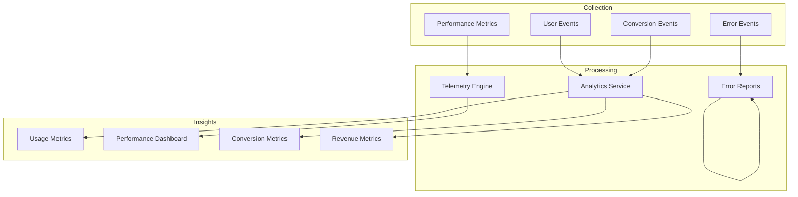
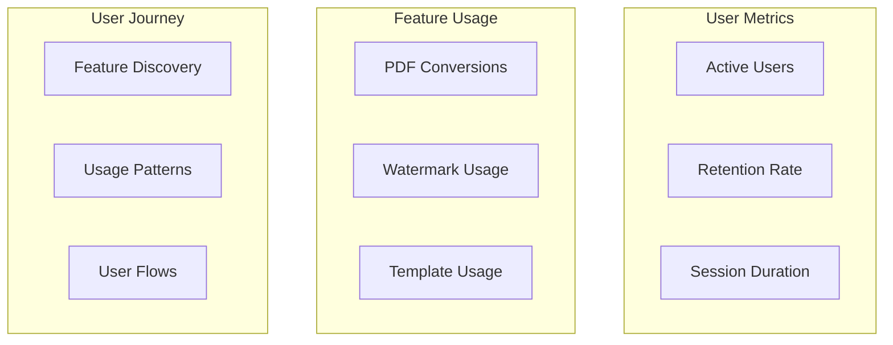
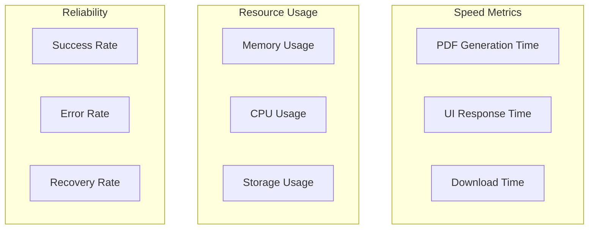
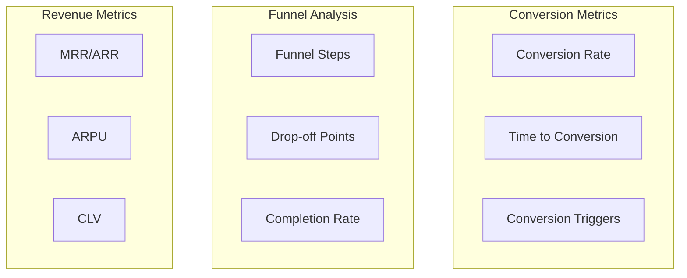
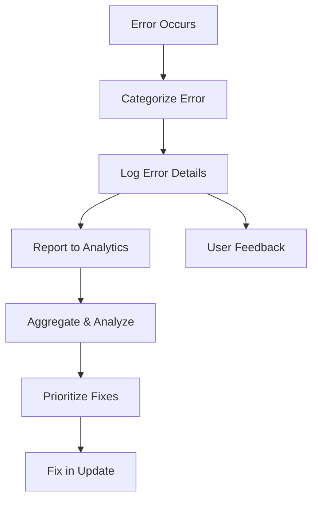
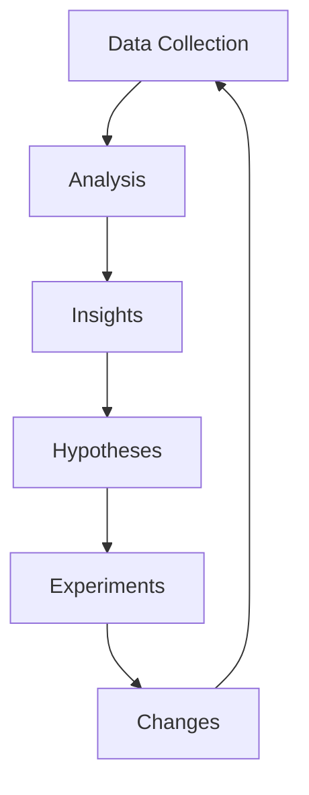

# PDF Buddy - Analytics Strategy

## Analytics Overview



## Key Metrics

### Usage Metrics
- **Active Users**:
  - Daily Active Users (DAU)
  - Weekly Active Users (WAU)
  - Monthly Active Users (MAU)
  - DAU/MAU ratio (stickiness)

- **Feature Usage**:
  - PDF conversions per user
  - Watermark usage rate
  - Template usage frequency
  - Settings changes
  - Context menu vs. browser action usage

- **Engagement**:
  - Session duration
  - Session frequency
  - Feature discovery rate
  - Advanced feature exploration

### Conversion Metrics
- **Free to Premium**:
  - Conversion rate
  - Time to conversion
  - Conversion path analysis
  - Feature triggers for conversion

- **Funnel Analysis**:
  - Premium feature exploration
  - Upgrade page visits
  - Payment initiation
  - Payment completion
  - Abandonment points

- **Pricing Impact**:
  - Conversion rate by pricing tier
  - Discount effectiveness
  - Trial conversion rate
  - Promotional response rate

### Performance Metrics
- **Speed**:
  - PDF generation time
  - Watermark application time
  - UI response time
  - Download initiation time

- **Resource Usage**:
  - Memory consumption
  - CPU utilization
  - Storage usage
  - Network requests

- **Reliability**:
  - Success rate of PDF generation
  - Error frequency
  - Crash rate
  - Recovery success rate

### Revenue Metrics
- **Revenue Overview**:
  - Monthly Recurring Revenue (MRR)
  - Annual Recurring Revenue (ARR)
  - Average Revenue Per User (ARPU)
  - Customer Lifetime Value (CLV)

- **Subscription Metrics**:
  - Renewal rate
  - Churn rate
  - Upgrade rate
  - Downgrade rate

- **Business Health**:
  - Customer Acquisition Cost (CAC)
  - CLV to CAC ratio
  - Payback period
  - Growth rate

## Implementation Strategy

### Data Collection

```javascript
// Analytics implementation pseudocode
class Analytics {
  constructor() {
    this.userId = this.generateAnonymousId();
    this.sessionId = this.generateSessionId();
    this.events = [];
    this.flushInterval = setInterval(() => this.flush(), 60000);
  }
  
  // Track general events
  trackEvent(category, action, label, value) {
    const event = {
      type: 'event',
      category,
      action,
      label,
      value,
      timestamp: Date.now(),
      sessionId: this.sessionId,
      userId: this.userId
    };
    
    this.events.push(event);
    this.conditionalFlush();
  }
  
  // Track feature usage
  trackFeature(featureName, successful, metadata = {}) {
    this.trackEvent('Feature', featureName, successful ? 'Success' : 'Failure', metadata);
  }
  
  // Track conversion funnel
  trackConversion(stage, successful, metadata = {}) {
    this.trackEvent('Conversion', stage, successful ? 'Success' : 'Failure', metadata);
  }
  
  // Track errors
  trackError(errorType, message, stackTrace, metadata = {}) {
    const event = {
      type: 'error',
      errorType,
      message,
      stackTrace,
      metadata,
      timestamp: Date.now(),
      sessionId: this.sessionId,
      userId: this.userId
    };
    
    this.events.push(event);
    this.conditionalFlush();
  }
  
  // Track performance
  trackPerformance(metricName, duration, metadata = {}) {
    const event = {
      type: 'performance',
      metricName,
      duration,
      metadata,
      timestamp: Date.now(),
      sessionId: this.sessionId,
      userId: this.userId
    };
    
    this.events.push(event);
    this.conditionalFlush();
  }
  
  // Helper methods
  conditionalFlush() {
    if (this.events.length >= 10) {
      this.flush();
    }
  }
  
  async flush() {
    if (this.events.length === 0) return;
    
    const eventsToSend = [...this.events];
    this.events = [];
    
    try {
      await fetch('https://analytics.pdfbuddy.com/collect', {
        method: 'POST',
        headers: {
          'Content-Type': 'application/json'
        },
        body: JSON.stringify({
          events: eventsToSend,
          extension: {
            version: chrome.runtime.getManifest().version,
            browser: this.getBrowserInfo()
          }
        })
      });
    } catch (error) {
      // Store failed events for retry
      this.events = [...eventsToSend, ...this.events];
      console.error('Failed to send analytics:', error);
    }
  }
  
  // Other utility methods...
}
```

### Privacy Considerations
- **Anonymization**: User identifiers are anonymized
- **Data Minimization**: Only collect necessary data
- **Retention Policy**: Clear data retention timeframes
- **Transparency**: Clear privacy policy explaining data usage
- **Opt-out**: Allow users to opt out of non-essential data collection

### Compliance Requirements
- **GDPR**: European privacy regulations
- **CCPA**: California privacy regulations
- **Chrome Web Store**: Analytics disclosure requirements
- **Industry Standards**: Best practices for extension analytics

## Analytics Dashboard

### Usage Dashboard


### Performance Dashboard


### Conversion Dashboard


## Error Tracking

### Error Categories
- **User Errors**: Invalid inputs or actions
- **System Errors**: Extension failures
- **API Errors**: External service failures
- **Resource Errors**: Memory or performance issues
- **Unknown Errors**: Unexpected failures

### Error Handling Flow


### Error Reporting Implementation
```javascript
// Error handler pseudocode
class ErrorHandler {
  constructor(analytics) {
    this.analytics = analytics;
    this.setupGlobalHandlers();
  }
  
  setupGlobalHandlers() {
    window.onerror = (message, source, lineno, colno, error) => {
      this.handleError('uncaught', message, error?.stack, {
        source,
        lineno,
        colno
      });
      return true;
    };
    
    window.addEventListener('unhandledrejection', (event) => {
      this.handleError('promise', event.reason.message, event.reason.stack, {
        reason: event.reason
      });
    });
  }
  
  handleError(type, message, stack, metadata = {}) {
    // Log error locally
    console.error(`[${type}] ${message}`, metadata);
    
    // Report to analytics
    this.analytics.trackError(type, message, stack, metadata);
    
    // Show user feedback if appropriate
    if (this.shouldShowUserFeedback(type, message)) {
      this.showUserFeedback(type, message);
    }
    
    // Attempt recovery if possible
    this.attemptRecovery(type, message, metadata);
  }
  
  // Other methods...
}
```

## Performance Monitoring

### Key Performance Indicators
- **Critical Path Metrics**:
  - Time to first render of popup
  - PDF generation time
  - Watermark application time
  - Download initiation time

- **Resource Utilization**:
  - Memory usage during PDF generation
  - CPU usage during watermark application
  - Storage usage for templates
  - Background script efficiency

### Performance Tracking Implementation
```javascript
// Performance monitoring pseudocode
class PerformanceMonitor {
  constructor(analytics) {
    this.analytics = analytics;
    this.metrics = {};
  }
  
  startTimer(metricName, metadata = {}) {
    this.metrics[metricName] = {
      startTime: performance.now(),
      metadata
    };
  }
  
  endTimer(metricName, additionalMetadata = {}) {
    const metric = this.metrics[metricName];
    if (!metric) {
      console.warn(`No timer found for metric: ${metricName}`);
      return;
    }
    
    const duration = performance.now() - metric.startTime;
    const metadata = { ...metric.metadata, ...additionalMetadata };
    
    // Report to analytics
    this.analytics.trackPerformance(metricName, duration, metadata);
    
    // Clean up
    delete this.metrics[metricName];
    
    return duration;
  }
  
  measureMemory() {
    if (performance.memory) {
      const memory = {
        totalJSHeapSize: performance.memory.totalJSHeapSize,
        usedJSHeapSize: performance.memory.usedJSHeapSize,
        jsHeapSizeLimit: performance.memory.jsHeapSizeLimit
      };
      
      this.analytics.trackPerformance('memory', 0, memory);
      return memory;
    }
    return null;
  }
  
  // Other methods...
}
```

## A/B Testing Framework

### Test Categories
- **UI Tests**: Different interface designs
- **Feature Tests**: Alternative implementations
- **Pricing Tests**: Different pricing models
- **Messaging Tests**: Alternative marketing messages
- **Onboarding Tests**: Different user introduction flows

### Implementation Strategy
```javascript
// A/B testing pseudocode
class ABTestingManager {
  constructor(analytics) {
    this.analytics = analytics;
    this.tests = {};
    this.userVariants = {};
    this.initialize();
  }
  
  async initialize() {
    // Load active tests
    const activeTests = await this.fetchActiveTests();
    
    // Assign user to variants
    for (const test of activeTests) {
      this.assignVariant(test);
    }
    
    // Track exposures
    this.trackExposures();
  }
  
  assignVariant(test) {
    // Check if user already assigned
    const savedVariant = localStorage.getItem(`abtest_${test.id}`);
    if (savedVariant) {
      this.userVariants[test.id] = savedVariant;
      return savedVariant;
    }
    
    // Assign based on distribution
    const variant = this.selectVariantBasedOnDistribution(test.variants);
    this.userVariants[test.id] = variant;
    localStorage.setItem(`abtest_${test.id}`, variant);
    
    return variant;
  }
  
  isInVariant(testId, variantId) {
    return this.userVariants[testId] === variantId;
  }
  
  trackConversion(testId, goalId, metadata = {}) {
    const variant = this.userVariants[testId];
    if (!variant) return;
    
    this.analytics.trackEvent('ABTest', 'Conversion', `${testId}:${variant}:${goalId}`, metadata);
  }
  
  // Other methods...
}
```

## Data Analysis

### Analysis Techniques
- **Cohort Analysis**: User behavior over time
- **Funnel Analysis**: Conversion path optimization
- **Retention Analysis**: User engagement patterns
- **Feature Impact**: Effect of features on key metrics
- **Segmentation**: Behavior differences across user groups

### Insight Generation
- **Automated Reports**: Regular metric summaries
- **Anomaly Detection**: Identifying unusual patterns
- **Trend Analysis**: Long-term metric changes
- **Correlation Analysis**: Relationships between metrics
- **Predictive Modeling**: Forecasting future metrics

## Continuous Improvement

### Feedback Loop


### Implementation Process
1. **Collect**: Gather analytics data
2. **Analyze**: Identify patterns and opportunities
3. **Hypothesize**: Develop theories for improvement
4. **Test**: Implement A/B tests or targeted changes
5. **Measure**: Evaluate impact on key metrics
6. **Iterate**: Refine based on results
