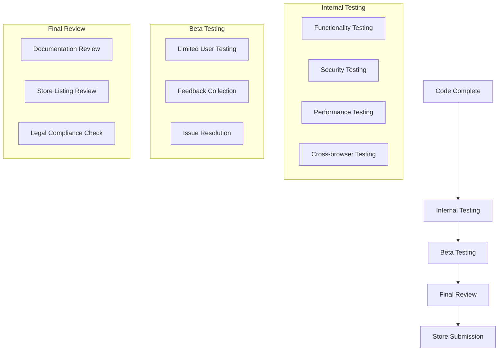
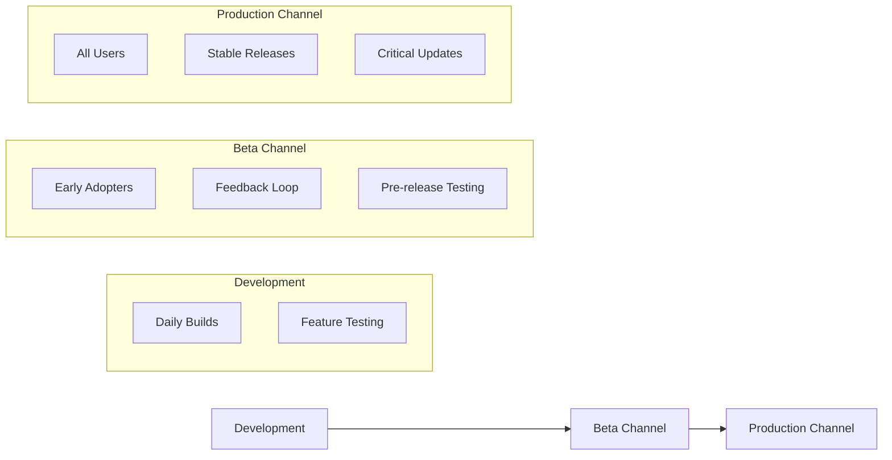
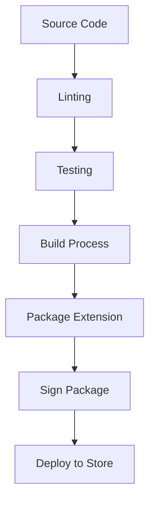
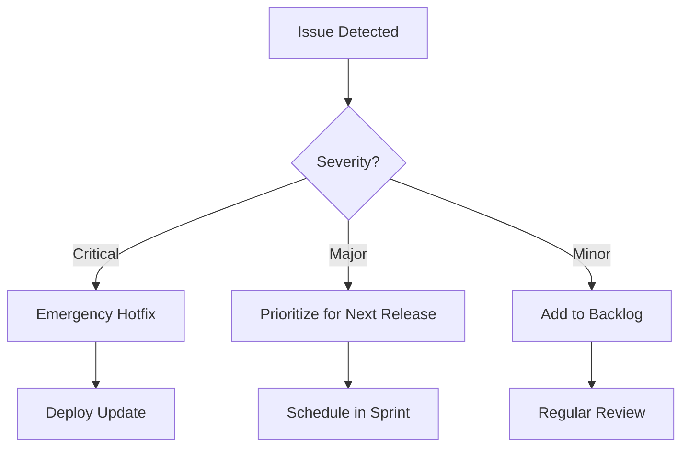

# PDF Buddy - Deployment Strategy

## Domain and Contact Information

- **Domain**: [pdfbuddy.app](https://pdfbuddy.app)
- **Support Email**: support@pdfbuddy.app
- **Primary Website**: https://pdfbuddy.app

## Chrome Web Store Requirements

### Store Listing Requirements
- **Name**: "PDF Buddy - Save & Watermark"
- **Website**: https://pdfbuddy.app
- **Summary**: Brief description (max 132 characters)
- **Description**: Detailed description (max 16,000 characters)
- **Icon**: 128x128 PNG icon
- **Screenshots**: 1280x800 or 640x400 PNG/JPEG (min 1, max 5)
- **Promotional Images**:
  - Small promo tile: 440x280 PNG/JPEG (optional)
  - Large promo tile: 920x680 PNG/JPEG (optional)
  - Marquee promo tile: 1400x560 PNG/JPEG (optional)

### Technical Requirements
- **Manifest Version**: Manifest V3 required
- **Permissions**: Justification for each permission requested
- **Content Security Policy**: Compliant with Chrome's CSP requirements
- **Size Limit**: Under 10MB for the packaged extension
- **Performance**: Efficient resource usage
- **Offline Functionality**: Clear indication of online requirements

### Policy Compliance
- **Privacy Policy**: Required for extensions that handle user data
- **Terms of Service**: Clear user agreement
- **Data Usage**: Transparent data collection practices
- **Monetization**: Compliance with Chrome Web Store payment policies
- **Intellectual Property**: No copyright or trademark infringement
- **Content Guidelines**: Appropriate for all audiences

## Release Checklist

### Pre-Submission Testing


### Submission Checklist
1. **Code Preparation**
   - [ ] Remove all console.log statements
   - [ ] Minify and optimize code
   - [ ] Update version number in manifest
   - [ ] Generate production build

2. **Documentation**
   - [ ] Complete README
   - [ ] Update changelog
   - [ ] Prepare user documentation
   - [ ] Create support resources

3. **Store Listing**
   - [ ] Craft compelling description
   - [ ] Create high-quality screenshots
   - [ ] Design promotional images
   - [ ] Prepare privacy policy
   - [ ] Prepare terms of service

4. **Testing**
   - [ ] Functionality testing complete
   - [ ] Security testing complete
   - [ ] Performance testing complete
   - [ ] Cross-browser testing complete
   - [ ] Beta testing feedback addressed

5. **Legal & Compliance**
   - [ ] Privacy policy compliant with regulations
   - [ ] Terms of service legally sound
   - [ ] All licenses for third-party code documented
   - [ ] Data handling practices documented

6. **Final Verification**
   - [ ] Extension package under size limit
   - [ ] All permissions justified
   - [ ] CSP compliant
   - [ ] No console errors or warnings

## Update Strategy

### Version Management
- **Semantic Versioning**: MAJOR.MINOR.PATCH
  - MAJOR: Incompatible API changes
  - MINOR: Backwards-compatible functionality
  - PATCH: Backwards-compatible bug fixes

### Release Channels


### Update Types
- **Feature Updates**: New functionality (MINOR version bump)
- **Bug Fixes**: Issue resolutions (PATCH version bump)
- **Security Updates**: Critical security patches (expedited release)
- **Major Releases**: Significant changes (MAJOR version bump, beta testing required)

### Update Frequency
- **Patch Updates**: As needed for critical fixes
- **Minor Updates**: Monthly for feature additions
- **Major Updates**: Quarterly for significant changes

## Deployment Process

### Build Pipeline


### Automated Deployment
```javascript
// Example GitHub Actions workflow
name: Deploy to Chrome Web Store
on:
  push:
    tags:
      - 'v*'
jobs:
  build-and-deploy:
    runs-on: ubuntu-latest
    steps:
      - uses: actions/checkout@v2
      - name: Setup Node.js
        uses: actions/setup-node@v2
        with:
          node-version: '16'
      - name: Install dependencies
        run: npm ci
      - name: Lint
        run: npm run lint
      - name: Test
        run: npm test
      - name: Build
        run: npm run build
      - name: Package
        run: npm run package
      - name: Deploy to Chrome Web Store
        uses: trmcnvn/chrome-addon@v2
        with:
          extension: ${{ secrets.EXTENSION_ID }}
          zip: dist/extension.zip
          client-id: ${{ secrets.CLIENT_ID }}
          client-secret: ${{ secrets.CLIENT_SECRET }}
          refresh-token: ${{ secrets.REFRESH_TOKEN }}
```

## Post-Deployment Monitoring

### User Feedback Monitoring
- Chrome Web Store reviews and ratings
- Support email monitoring (support@pdfbuddy.app)
- Social media mentions
- User surveys

### Technical Monitoring
- Error tracking via analytics
- Performance monitoring
- Usage statistics
- Feature adoption rates

### Response Plan


## Store Optimization

### Visibility Strategy
- **Keywords**: Strategic use of relevant keywords
- **Description**: Clear value proposition and feature highlights
- **Screenshots**: Showcase key features and benefits
- **Reviews**: Encourage positive reviews from satisfied users

### Conversion Optimization
- **Clear CTA**: Prominent "Add to Chrome" messaging
- **Feature Highlights**: Most compelling features prominently displayed
- **Social Proof**: User testimonials and review count
- **Trust Indicators**: Privacy assurances and developer credibility

## Legal Requirements

### Privacy Policy
- **Data Collection**: What data is collected
- **Data Usage**: How data is used
- **Data Sharing**: Whether data is shared with third parties
- **Data Security**: How data is protected
- **User Rights**: How users can access or delete their data
- **Contact Information**: support@pdfbuddy.app for privacy inquiries
- **Policy Location**: https://pdfbuddy.app/privacy

### Terms of Service
- **License Terms**: How the software can be used
- **Limitations**: What users cannot do with the software
- **Warranties**: What guarantees are provided (or disclaimed)
- **Liability**: Limitations of liability
- **Termination**: Conditions for service termination
- **Contact Information**: support@pdfbuddy.app for terms inquiries
- **Terms Location**: https://pdfbuddy.app/terms

## Support Infrastructure

### Support Channels
- **Email Support**: support@pdfbuddy.app (primary support channel)
- **Documentation**: Self-service help resources at https://pdfbuddy.app/docs
- **FAQ**: Common questions and answers at https://pdfbuddy.app/faq
- **Community Forum**: Peer support (future consideration)

### Issue Tracking
- GitHub Issues for bug tracking
- Feature request management
- Resolution timeline communication
- Status updates for reported issues

## Future Expansion

### Platform Expansion
- Firefox extension
- Edge extension
- Safari extension
- Mobile companion apps

### Feature Roadmap
- Advanced PDF editing
- Document management
- Collaboration features
- Enterprise integration
