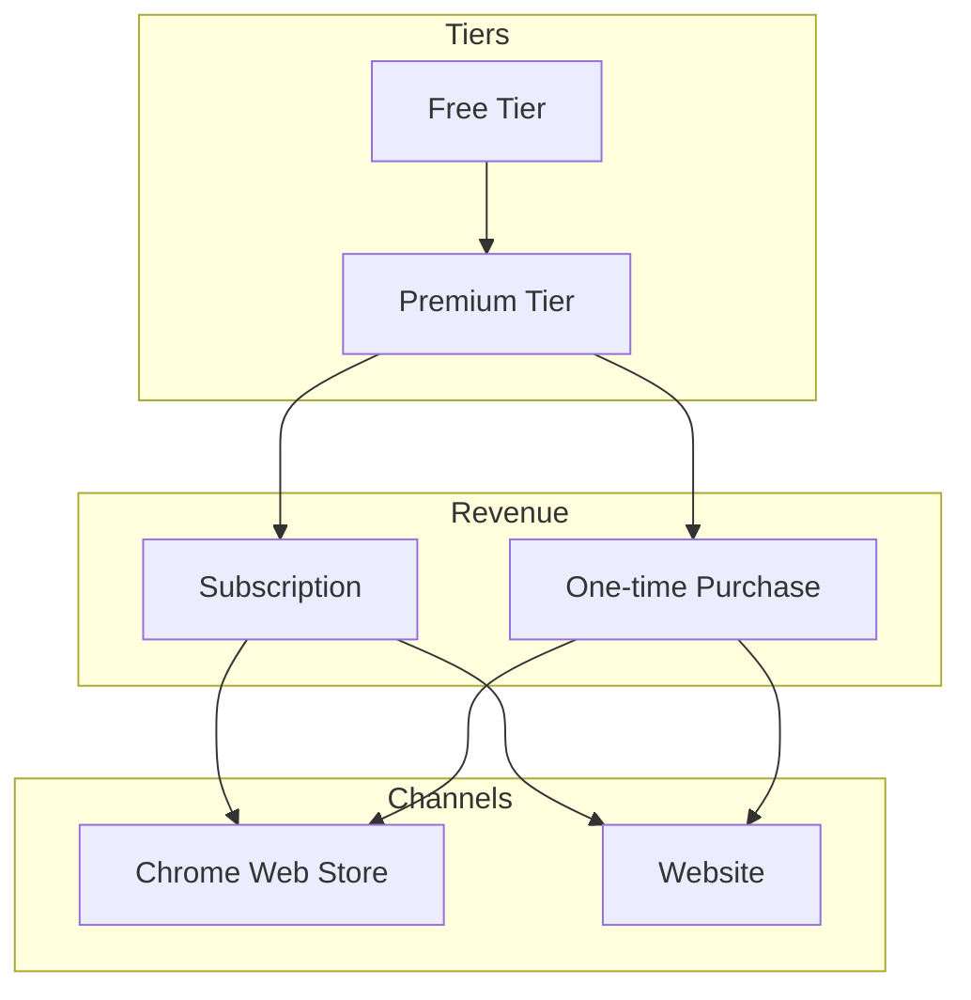
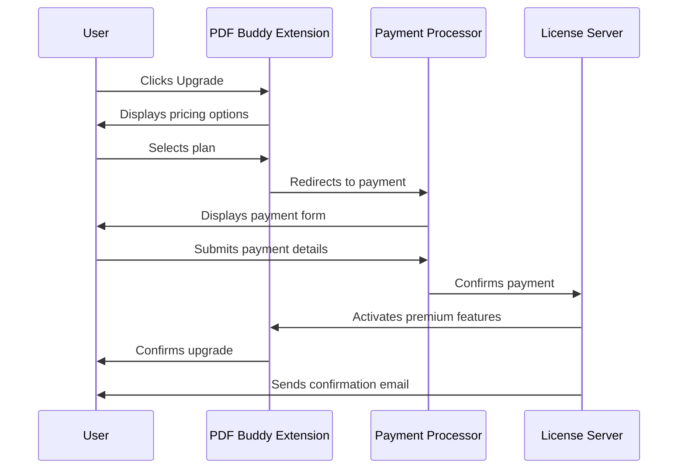

# PDF Buddy - Monetization Strategy

## Business Model Overview



## Feature Tier Definitions

### Free Tier
- **Core Functionality**:
  - Basic PDF conversion of web pages
  - Simple text watermarks
  - Limited positioning options (center, corners)
  - Basic font customization
  - Up to 3 saved templates
  - Single file processing

- **Limitations**:
  - No image watermarks
  - Limited styling options
  - No cloud storage
  - No batch processing
  - Basic support only

- **Purpose**:
  - Demonstrate core value
  - Build user base
  - Drive conversions to premium

### Premium Tier
- **Enhanced Functionality**:
  - All free features
  - Image watermarks
  - Advanced text styling
  - Precise positioning control
  - Rotation and scaling options
  - Opacity and blend mode controls
  - Unlimited templates
  - Template categories
  - Batch processing
  - Cloud storage for templates
  - Priority support
  - Regular feature updates

- **Purpose**:
  - Revenue generation
  - Enhanced user experience
  - Professional use cases

## Pricing Strategy

### Subscription Model
- **Monthly**: $4.99/month
- **Annual**: $39.99/year (33% savings)
- **Team**: $9.99/month for up to 5 users

### One-time Purchase
- **Lifetime License**: $79.99
- **Promotional Pricing**: $59.99 for early adopters

### Trial Options
- 14-day free trial of premium features
- Money-back guarantee for first 30 days

## Payment Processing Flow



## License Management Approach

### License Types
- **User-based**: Tied to user account
- **Device-based**: Limited to specific number of devices
- **Mixed**: User account with device limits

### Verification Methods
- **Online Verification**: Regular check with license server
- **Offline Mode**: Limited-time offline usage
- **Token-based**: Renewable authentication tokens

### Implementation
```javascript
// License verification pseudocode
class LicenseManager {
  constructor() {
    this.licenseStatus = 'free';
    this.features = {
      textWatermark: true,
      imageWatermark: false,
      templates: { limit: 3 },
      batch: false,
      // ...other features
    };
  }
  
  async verifyLicense(licenseKey) {
    try {
      const response = await fetch('https://api.pdfbuddy.com/verify', {
        method: 'POST',
        body: JSON.stringify({ licenseKey })
      });
      
      const data = await response.json();
      
      if (data.valid) {
        this.licenseStatus = 'premium';
        this.features = data.features;
        this.expiryDate = data.expiryDate;
        return true;
      }
      
      return false;
    } catch (error) {
      console.error('License verification failed:', error);
      return this.handleOfflineVerification();
    }
  }
  
  canUseFeature(featureName) {
    return this.features[featureName] === true;
  }
  
  // Other methods...
}
```

## Feature Gating Strategy

### Technical Implementation
- Feature flags in code
- Server-side verification for critical features
- Graceful degradation for expired licenses
- Clear upgrade prompts for gated features

### User Experience
- Non-intrusive premium indicators
- "Preview" capability for premium features
- Clear value proposition when encountering limits
- Seamless upgrade process

## Analytics and Metrics

### Key Performance Indicators
- Conversion rate (free to premium)
- Average revenue per user (ARPU)
- Customer lifetime value (CLV)
- Churn rate
- Feature usage statistics
- Upgrade funnel completion rate

### Implementation
```javascript
// Analytics pseudocode
class AnalyticsManager {
  trackEvent(category, action, label, value) {
    // Implementation
  }
  
  trackFeatureUsage(featureName, successful) {
    this.trackEvent('Feature', 'Use', featureName, successful ? 1 : 0);
    
    if (!successful && isFeaturePremium(featureName)) {
      this.trackEvent('Premium', 'Prompt', featureName);
    }
  }
  
  trackUpgradeFlow(step, successful) {
    this.trackEvent('Upgrade', step, successful ? 'Success' : 'Failure');
  }
  
  // Other methods...
}
```

## Promotional Strategy

### In-app Promotions
- Feature discovery tours
- Contextual upgrade prompts
- Limited-time feature trials
- Seasonal discounts

### External Marketing
- Chrome Web Store optimization
- Content marketing (blog, tutorials)
- Social media presence
- Targeted advertising

## Revenue Projections

### Year 1 Targets
- 10,000 free users
- 5% conversion rate to premium
- 500 premium users
- Average revenue: $50/premium user/year
- Projected revenue: $25,000

### 3-Year Projection
- 50,000 free users
- 8% conversion rate to premium
- 4,000 premium users
- Average revenue: $60/premium user/year
- Projected revenue: $240,000

## Competitive Analysis

### Market Positioning
- **Unique Selling Proposition**: Simplicity + Professional Watermarking
- **Price Comparison**: 20-30% below enterprise solutions
- **Feature Comparison**: More focused than enterprise, more powerful than free alternatives

### Competitor Pricing
- Enterprise PDF solutions: $10-20/month
- Simple PDF tools: Free to $2.99/month
- Our positioning: $4.99/month (premium quality, mid-range price)

## Future Monetization Opportunities

### Additional Revenue Streams
- **API Access**: For enterprise integration
- **White Label**: For business customers
- **Additional Features**:
  - Advanced PDF editing
  - Document management
  - Collaboration features
  - Integration with other services

### Expansion Strategy
- Browser support expansion
- Mobile companion apps
- Desktop application
- Web service version
