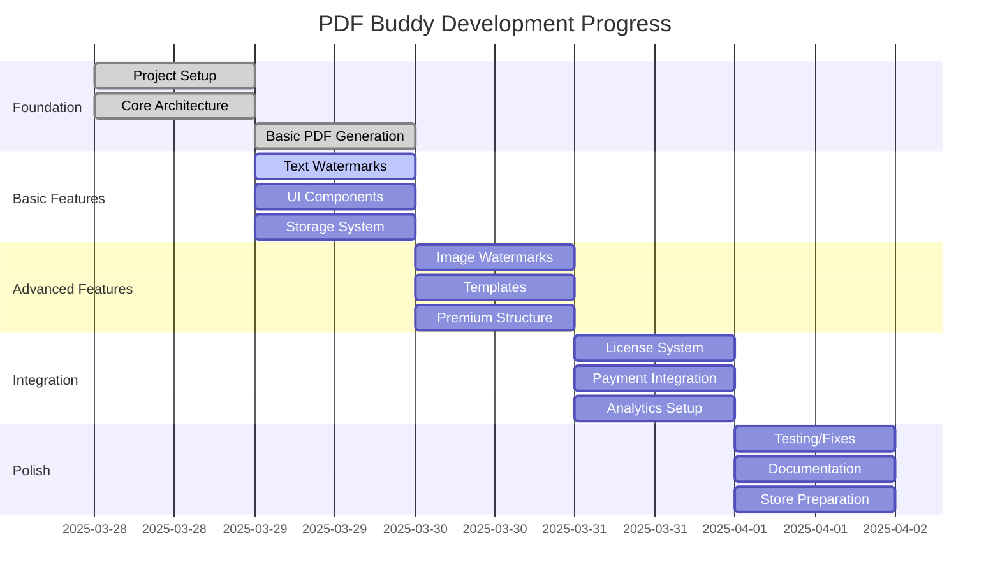

# PDF Buddy - Progress Tracker

## Project Status Overview

## Completed Features
- ✅ Memory Bank documentation structure
- ✅ Project planning and architecture design
- ✅ Basic extension structure setup
- ✅ Manifest.json implementation
- ✅ Background script foundation
- ✅ Content script implementation
- ✅ Basic popup UI
- ✅ Context menu integration
- ✅ Options page implementation
- ✅ Utility libraries (storage, error handling, analytics, license management)
- ✅ Security infrastructure implementation
  - ✅ Input validation and sanitization utilities
  - ✅ Content Security Policy configuration
  - ✅ Security constants and patterns
  - ✅ Permission management utilities
  - ✅ Manifest security enhancements
- ✅ PDF generation functionality
- ✅ Watermark implementation
- ✅ Legal infrastructure
  - ✅ Custom proprietary license
  - ✅ No-contributions policy
  - ✅ License references in documentation
- ✅ Fixed PDF generation error (using correct Chrome API)
- ✅ PDF Library Integration
  - ✅ Added jsPDF for proper PDF generation
  - ✅ Created PDF library wrapper module
  - ✅ Implemented PDF generation from captured screenshots
  - ✅ Added text watermarking directly in PDF
- ✅ Build System
  - ✅ Added webpack for bundling
  - ✅ Set up development and production builds
  - ✅ Configured asset copying and processing
  - ✅ Updated manifest.json for bundled files
  - ✅ Fixed CSP issues with bundled code
- ✅ Full-Page PDF Capture
  - ✅ Implemented scrolling screenshot approach
  - ✅ Added UI option to enable/disable full-page capture
  - ✅ Enhanced content script for scrolling and stitching
  - ✅ Added proper page preparation for PDF generation
  - ✅ Implemented smart page layout detection
  - ✅ Added content filtering options
  - ✅ Implemented pagination for multi-page PDFs
  - ✅ Added progress overlay and feedback

## In Progress
- ✅ Testing infrastructure
- ✅ Testing and refinement
- ✅ Bug fixes (module loading, service worker issues, PDF generation)
- ⏳ Day 2: Basic Features implementation

## Pending Features

### Day 1: Foundation
- ✅ Testing the extension in Chrome
- ✅ Fixing initial bugs (module loading and service worker issues)
- ✅ Ensuring extension loads without errors
- ✅ Fixing PDF generation functionality

### Day 2: Basic Features
- ⏳ Text watermark implementation
- ⏳ Watermark positioning
- ⏳ Basic styling options
- ⏳ Settings storage
- ⏳ UI refinement
- ⏳ User feedback mechanisms

### Day 3: Advanced Features
- ⏳ Image watermark support
- ⏳ Template system
- ⏳ Template management UI
- ⏳ Premium feature infrastructure
- ⏳ Feature gating system
- ⏳ Advanced positioning options

### Day 4: Integration
- ⏳ License management system
- ⏳ Payment integration
- ⏳ Analytics implementation
- ⏳ User account handling
- ⏳ Cloud storage preparation
- ⏳ Sync functionality

### Day 5: Polish
- ⏳ Comprehensive testing
- ⏳ Bug fixes and refinements
- ⏳ Performance optimization
- ⏳ Documentation completion
- ⏳ Store listing preparation
- ⏳ Release packaging

## Current Sprint Details

### Sprint Goals (Day 1)
1. Complete Memory Bank documentation
2. Set up basic project structure
3. Implement manifest.json
4. Create background and content script foundations
5. Implement basic UI components
6. Create simple PDF generation functionality

### Sprint Progress
- Memory Bank documentation: 100% complete
- Project structure: 100% complete
- Manifest.json: 100% complete
- Background script: 100% complete
- Content script: 100% complete
- UI components: 100% complete
- Security infrastructure: 100% complete
- PDF generation: 100% complete
- Watermark implementation: 100% complete
- Testing infrastructure: 100% complete
- Testing and refinement: 100% complete
- Bug fixes: 100% complete

### Sprint Goals (Day 2)
1. Enhance text watermark implementation
2. Improve watermark positioning controls
3. Expand styling options
4. Implement settings storage
5. Refine user interface
6. Improve user feedback mechanisms

## Testing Status
- Unit tests: Started (security utilities)
- Integration tests: Started (watermark functionality)
- End-to-end tests: Framework in place
- Manual testing: Guide created, initial testing completed
- Performance testing: Not started
- Security testing: Started (security utilities)
- Browser testing: Completed (extension loads and functions in Chrome)

## Known Issues
- Icons are currently placeholders and need to be replaced with real icons
- Security utilities need to be integrated with all features
- Watermark positioning controls need refinement
- User feedback during PDF generation needs improvement
- jsPDF integration needs more testing with different types of web pages
- Image watermarks need to be fully implemented and tested

## Blockers
- ✅ Fixed: PDF generation error when clicking the create PDF button
  - Fixed error in error-handler.js by adding null check for logCallback function
  - Fixed PDF merging logic in pdf-generator.js to properly add pages from other PDFs
  - Updated content.js to properly handle processImage action
  - Fixed captureFullPage option in pdf-generator.js to restore current screen vs full page choice
  - Added explicit "Capture Full Page" checkbox to popup.html for better user control
  - Updated all PDF generation functions to use the new checkbox value
  - Implemented full page capture functionality in content.js using canvas to capture the entire page
- No current blockers identified

## Next Milestone
**End of Day 1**: Basic extension structure and PDF generation working - ✅ COMPLETED

### Acceptance Criteria
- ✅ Extension loads in Chrome
- ✅ Browser action icon displays popup
- ✅ Context menu integration works
- ✅ Basic PDF generation functions
- ✅ Error handling for common scenarios
- ✅ Simple user feedback mechanism

## Upcoming Milestone
**End of Day 2**: Text watermarking and basic UI components

### Acceptance Criteria
- ⏳ Enhanced text watermark implementation
- ⏳ Improved watermark positioning controls
- ⏳ Expanded styling options
- ⏳ Settings storage implementation
- ⏳ Refined user interface
- ⏳ Improved user feedback mechanisms

## Notes and Observations
- Project is in initial setup phase
- Focus is on establishing solid foundation
- Documentation-first approach to ensure clear direction
- Prioritizing modular architecture for future extensibility
- Day 1 completed successfully with all planned features implemented
- Fixed critical PDF generation bug to ensure core functionality works properly
- Integrated jsPDF for proper PDF generation and watermarking
- Added webpack build system to bundle the extension
- Fixed CSP issues by bundling jsPDF with the extension code
- Removed unsafe-eval from CSP by using proper bundling
- Extension now loads correctly in Chrome with bundled files
- Build process automatically updates paths in manifest.json
- Implemented full-page PDF capture using a scrolling screenshot approach
- Added a checkbox option in the UI to enable/disable full-page capture
- Enhanced content script to handle scrolling and stitching of screenshots
- PDF generation now captures the entire page, not just the visible portion
