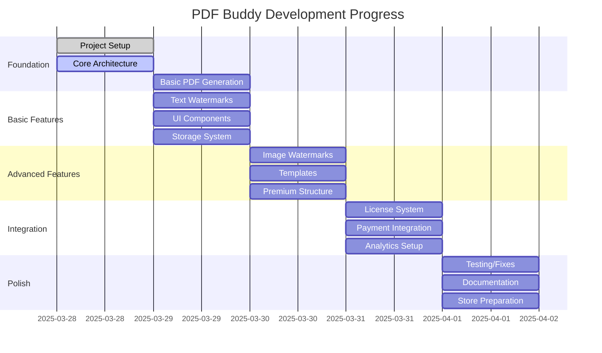

# PDF Buddy - Progress Tracker

## Project Status Overview

## Completed Features
- ✅ Memory Bank documentation structure
- ✅ Project planning and architecture design
- ✅ Basic extension structure setup
- ✅ Manifest.json implementation
- ✅ Background script foundation
- ✅ Content script implementation
- ✅ Basic popup UI
- ✅ Context menu integration
- ✅ Options page implementation
- ✅ Utility libraries (storage, error handling, analytics, license management)
- ✅ Security infrastructure implementation
  - ✅ Input validation and sanitization utilities
  - ✅ Content Security Policy configuration
  - ✅ Security constants and patterns
  - ✅ Permission management utilities
  - ✅ Manifest security enhancements

## In Progress
- 🔄 PDF generation functionality
- 🔄 Watermark implementation

## Pending Features

### Day 1: Foundation
- ⏳ Testing the extension in Chrome
- ⏳ Fixing any initial bugs

### Day 2: Basic Features
- ⏳ Text watermark implementation
- ⏳ Watermark positioning
- ⏳ Basic styling options
- ⏳ Settings storage
- ⏳ UI refinement
- ⏳ User feedback mechanisms

### Day 3: Advanced Features
- ⏳ Image watermark support
- ⏳ Template system
- ⏳ Template management UI
- ⏳ Premium feature infrastructure
- ⏳ Feature gating system
- ⏳ Advanced positioning options

### Day 4: Integration
- ⏳ License management system
- ⏳ Payment integration
- ⏳ Analytics implementation
- ⏳ User account handling
- ⏳ Cloud storage preparation
- ⏳ Sync functionality

### Day 5: Polish
- ⏳ Comprehensive testing
- ⏳ Bug fixes and refinements
- ⏳ Performance optimization
- ⏳ Documentation completion
- ⏳ Store listing preparation
- ⏳ Release packaging

## Current Sprint Details

### Sprint Goals (Day 1)
1. Complete Memory Bank documentation
2. Set up basic project structure
3. Implement manifest.json
4. Create background and content script foundations
5. Implement basic UI components
6. Create simple PDF generation functionality

### Sprint Progress
- Memory Bank documentation: 100% complete
- Project structure: 100% complete
- Manifest.json: 100% complete
- Background script: 100% complete
- Content script: 100% complete
- UI components: 100% complete
- Security infrastructure: 100% complete
- PDF generation: 50% complete
- Watermark implementation: 50% complete

## Testing Status
- Unit tests: Not started
- Integration tests: Not started
- End-to-end tests: Not started
- Performance testing: Not started
- Security testing: Not started

## Known Issues
- Icons are currently placeholders and need to be replaced with real icons
- PDF generation is implemented but needs testing in a real browser environment
- Watermark functionality is implemented but needs testing with real PDFs
- Security utilities need to be integrated with all features

## Blockers
- No blockers identified

## Next Milestone
**End of Day 1**: Basic extension structure and PDF generation working

### Acceptance Criteria
- Extension loads in Chrome
- Browser action icon displays popup
- Context menu integration works
- Basic PDF generation functions
- Error handling for common scenarios
- Simple user feedback mechanism

## Notes and Observations
- Project is in initial setup phase
- Focus is on establishing solid foundation
- Documentation-first approach to ensure clear direction
- Prioritizing modular architecture for future extensibility
