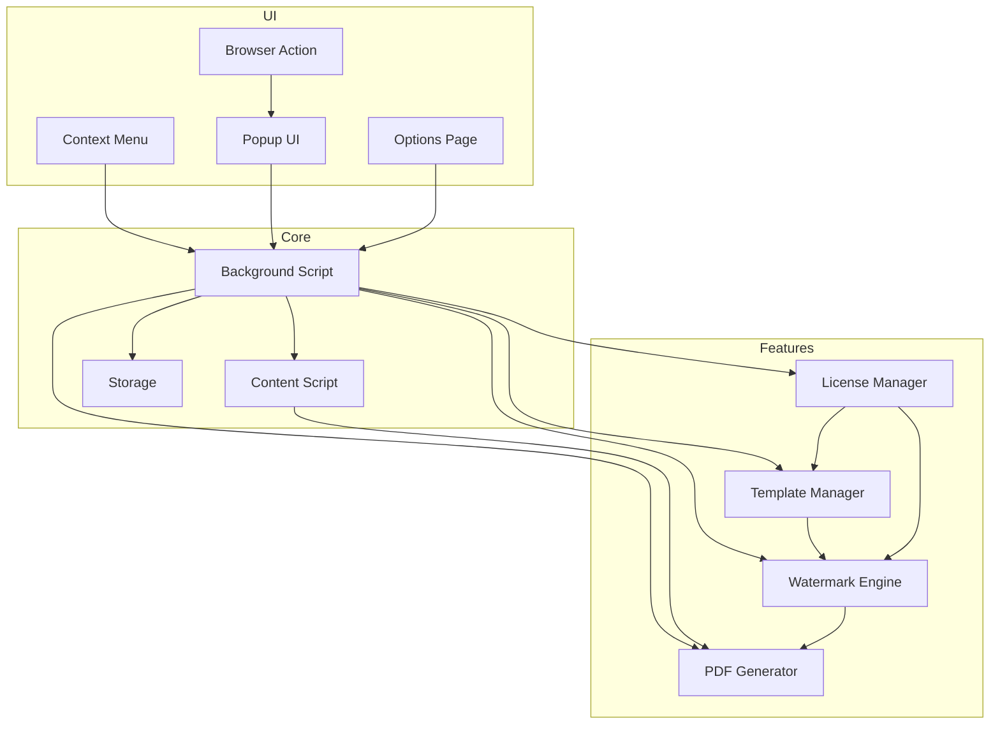
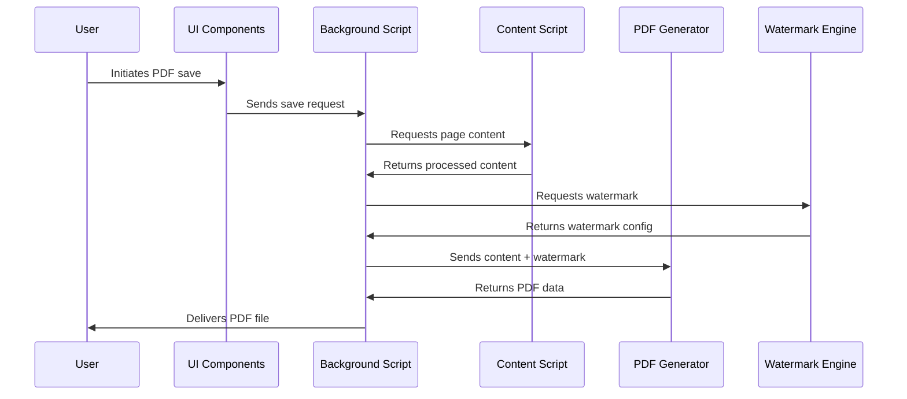
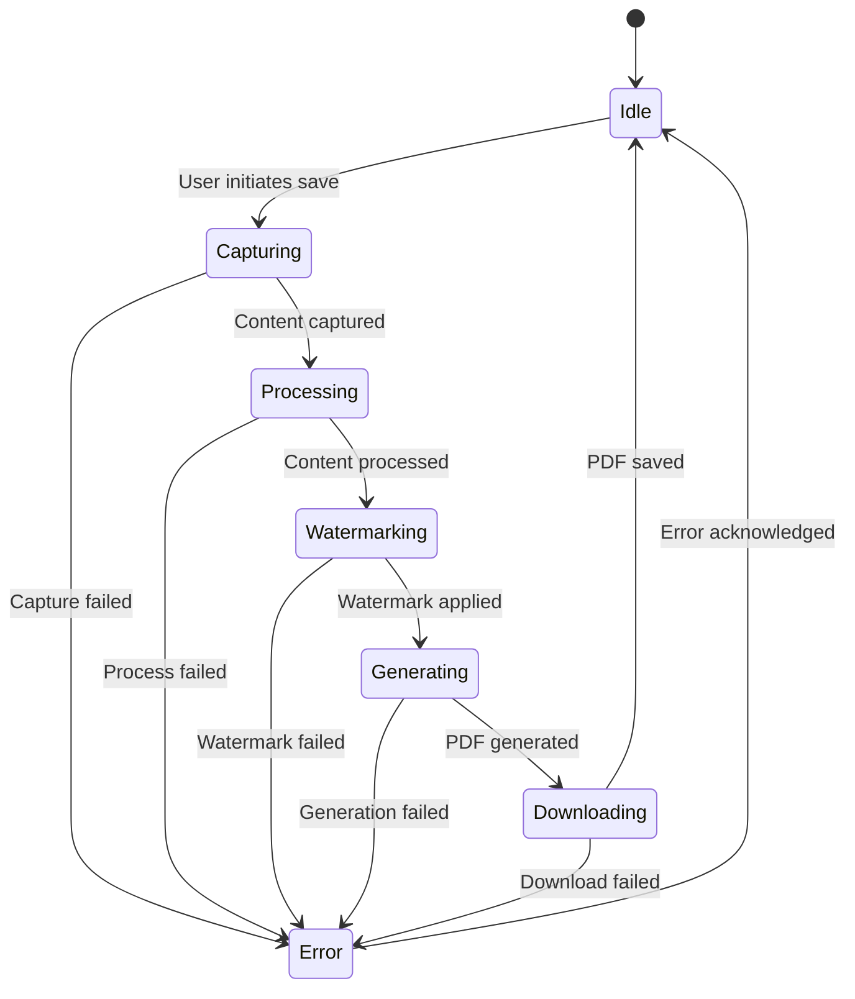
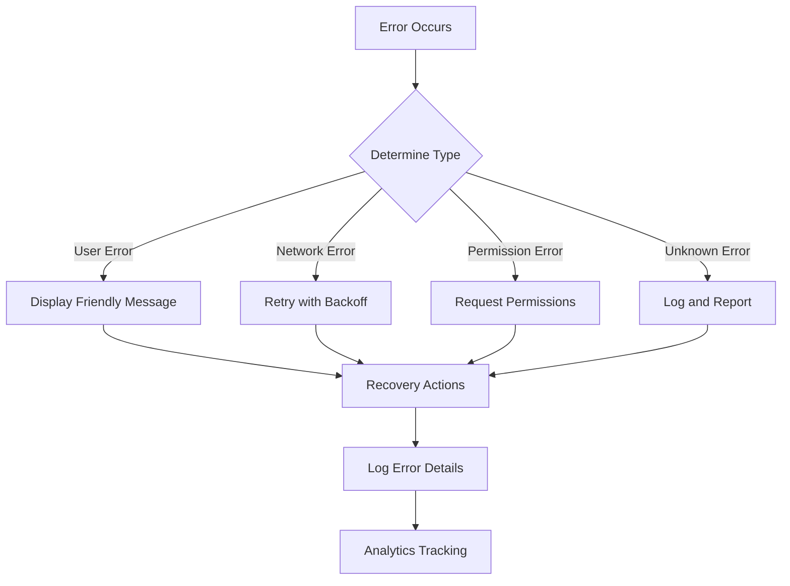
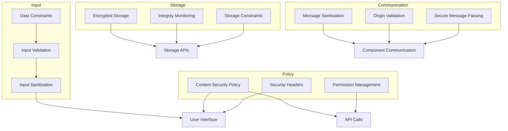

# PDF Buddy - System Patterns

## Architecture Overview



## Component Responsibilities

### UI Components
- **Browser Action**: Extension icon and popup trigger
- **Context Menu**: Right-click menu integration
- **Popup UI**: Quick access interface for common actions
- **Options Page**: Detailed settings and premium features

### Core Components
- **Background Script**: Central controller and state manager
- **Content Script**: Page interaction and content manipulation
- **Storage**: Settings and template persistence

### Feature Components
- **PDF Generator**: Handles conversion of web content to PDF
- **Watermark Engine**: Manages watermark creation and application
- **Template Manager**: Stores and retrieves watermark templates
- **License Manager**: Handles premium feature access control

## Communication Patterns



## State Management



## Design Patterns

### Module Pattern
Used throughout the extension to encapsulate functionality and prevent global namespace pollution.

```javascript
// Example module pattern implementation
const WatermarkEngine = (function() {
    // Private variables
    let templates = [];
    
    // Private methods
    function applyWatermark(content, config) {
        // Implementation
    }
    
    // Public API
    return {
        createWatermark: function(text, options) {
            // Implementation using private methods
        },
        
        getTemplates: function() {
            return [...templates];
        }
    };
})();
```

### Observer Pattern
Used for communication between components, particularly for state changes.

```javascript
// Example observer pattern implementation
const EventBus = (function() {
    const events = {};
    
    return {
        subscribe: function(event, callback) {
            if (!events[event]) events[event] = [];
            events[event].push(callback);
        },
        
        publish: function(event, data) {
            if (!events[event]) return;
            events[event].forEach(callback => callback(data));
        }
    };
})();
```

### Factory Pattern
Used for creating different types of watermarks.

```javascript
// Example factory pattern implementation
const WatermarkFactory = {
    createTextWatermark: function(text, options) {
        // Create text watermark
    },
    
    createImageWatermark: function(imageData, options) {
        // Create image watermark
    }
};
```

### Strategy Pattern
Used for different PDF generation approaches based on content type.

```javascript
// Example strategy pattern implementation
const pdfStrategies = {
    webpage: function(content) {
        // Convert webpage to PDF
    },
    
    document: function(content) {
        // Convert document to PDF
    }
};

function generatePDF(content, type) {
    return pdfStrategies[type](content);
}
```

## Error Handling Strategy



## Performance Considerations
- Lazy loading of premium features
- Efficient DOM manipulation in content scripts
- Throttling of resource-intensive operations
- Caching of frequently used templates
- Optimized watermark rendering

## Security Patterns



### Input Security
- **Validation**: All user inputs are validated against predefined patterns and constraints
- **Sanitization**: HTML and script content is sanitized to prevent XSS attacks
- **Type Checking**: Strict type checking is enforced for all function parameters
- **Length Constraints**: Input length limits are enforced to prevent buffer overflow attacks
- **Avoiding Double Sanitization**: Checking if data is already sanitized before applying sanitization to prevent unintended side effects

### Content Security Policy
- **Strict CSP**: Restrictive Content Security Policy to prevent XSS and data injection
- **Resource Restrictions**: Limits on where resources can be loaded from
- **Inline Script Prevention**: Blocking of inline scripts to prevent injection attacks
- **Frame Restrictions**: Control over which contexts can frame the extension pages

### Permission Management
- **Minimal Permissions**: Only requesting permissions that are absolutely necessary
- **Optional Permissions**: Using optional permissions for features that aren't core
- **Just-in-time Requests**: Requesting permissions only when needed for specific features
- **Permission Checking**: Verifying permissions before attempting operations

### Secure Storage
- **Data Validation**: Validation of all data before storage
- **Integrity Checking**: Verification that stored data hasn't been tampered with
- **Sensitive Data Handling**: Special handling for sensitive information
- **Storage Quotas**: Enforcing limits to prevent denial of service attacks

### Secure Communication
- **Message Validation**: Validation of all messages between components
- **Origin Checking**: Verification of message origins
- **Secure Message Passing**: Using Chrome's secure message passing APIs
- **Response Sanitization**: Sanitizing responses before processing

### Error Handling
- **Secure Error Messages**: Not exposing sensitive information in error messages
- **Graceful Degradation**: Failing safely when errors occur
- **Error Logging**: Comprehensive logging for security-related errors
- **Rate Limiting**: Preventing abuse through rate limiting of operations

## Testing Strategy
- Unit tests for core components
- Integration tests for feature workflows
- End-to-end tests for user scenarios
- Performance benchmarking
- Security auditing
