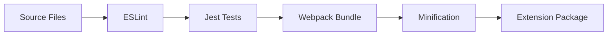
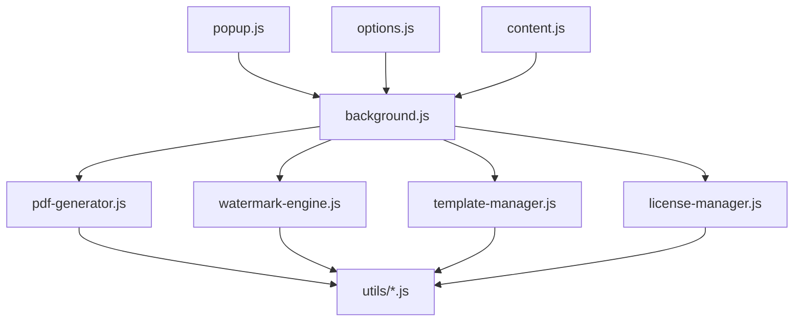

# PDF Buddy - Technical Context

## Technology Stack

### Core Technologies
- **JavaScript**: ES6+ for all extension functionality
- **HTML5**: For UI components and popup interfaces
- **CSS3**: For styling with minimal external dependencies
- **Chrome Extension API**: For browser integration

### Chrome Extension APIs
- **chrome.tabs**: For accessing and manipulating browser tabs
- **chrome.storage**: For persistent data storage
- **chrome.runtime**: For background script communication
- **chrome.contextMenus**: For right-click menu integration
- **chrome.downloads**: For handling PDF downloads

### PDF Generation
- **HTML to PDF Conversion**: Using Chrome's built-in printing capabilities
- **canvas API**: For watermark rendering and manipulation
- **Blob API**: For handling binary data

### Storage
- **chrome.storage.sync**: For user preferences and settings
- **chrome.storage.local**: For larger data like templates and images
- **IndexedDB** (optional): For more complex data storage needs

## Development Environment

### Tools
- **Node.js**: For build processes and development tools
- **npm/yarn**: For package management
- **webpack**: For bundling and optimization
- **ESLint**: For code quality and consistency
- **Jest**: For unit and integration testing
- **Chrome DevTools**: For debugging and performance analysis

### Build Process


### Directory Structure
```
pdfbuddy/
├── src/
│   ├── popup/
│   │   ├── popup.html
│   │   ├── popup.css
│   │   └── popup.js
│   ├── options/
│   │   ├── options.html
│   │   ├── options.css
│   │   └── options.js
│   ├── background/
│   │   └── background.js
│   ├── content/
│   │   └── content.js
│   ├── lib/
│   │   ├── pdf-generator.js
│   │   ├── watermark-engine.js
│   │   ├── template-manager.js
│   │   └── license-manager.js
│   └── utils/
│       ├── storage.js
│       ├── error-handler.js
│       └── analytics.js
├── assets/
│   ├── icons/
│   │   ├── icon-16.png
│   │   ├── icon-48.png
│   │   ├── icon-128.png
│   │   └── icon-512.png
│   └── templates/
│       └── default-watermarks.json
├── dist/
│   └── [build output]
├── tests/
│   ├── unit/
│   └── integration/
├── manifest.json
├── package.json
├── webpack.config.js
└── README.md
```

## Technical Constraints

### Browser Compatibility
- **Primary**: Chrome/Chromium-based browsers (Chrome, Edge, Brave, etc.)
- **Secondary**: Firefox (via WebExtensions API compatibility)

### Performance Considerations
- Maximum page size for PDF conversion
- Memory usage during watermark rendering
- Storage limitations for templates and settings
- Processing time for complex watermarks

### Security Constraints
- Content Security Policy compliance
- Cross-origin restrictions
- Permission requirements
- User data handling (GDPR, CCPA compliance)

### Chrome Web Store Requirements
- Size limitations (maximum extension size)
- Permission justification
- Privacy policy requirements
- Content guidelines compliance

## Dependencies

### External Libraries
- Minimal use of external libraries to keep the extension lightweight
- Potential candidates if needed:
  - **jsPDF**: For enhanced PDF manipulation (if Chrome's built-in capabilities are insufficient)
  - **html2canvas**: For capturing complex page elements
  - **fabric.js**: For advanced watermark editing (premium feature)

### Internal Dependencies



## API Interfaces

### PDF Generation API
```javascript
/**
 * Generates a PDF from the current tab
 * @param {Object} options - Configuration options
 * @param {boolean} options.includeBackground - Include background graphics
 * @param {string} options.filename - Output filename
 * @param {Object} watermarkConfig - Watermark configuration
 * @returns {Promise<Blob>} - PDF data as Blob
 */
function generatePDF(options, watermarkConfig) {
    // Implementation
}
```

### Watermark API
```javascript
/**
 * Creates a watermark configuration
 * @param {string|Blob} content - Text or image content
 * @param {Object} options - Watermark options
 * @param {string} options.position - Position (center, topLeft, etc.)
 * @param {number} options.opacity - Opacity (0-1)
 * @param {number} options.rotation - Rotation in degrees
 * @param {Object} options.style - Style options (color, font, etc.)
 * @returns {Object} - Watermark configuration
 */
function createWatermark(content, options) {
    // Implementation
}
```

### Storage API
```javascript
/**
 * Saves a template to storage
 * @param {string} name - Template name
 * @param {Object} template - Template configuration
 * @returns {Promise<void>}
 */
function saveTemplate(name, template) {
    // Implementation
}

/**
 * Retrieves a template from storage
 * @param {string} name - Template name
 * @returns {Promise<Object>} - Template configuration
 */
function getTemplate(name) {
    // Implementation
}
```

## Testing Strategy

### Unit Testing
- Component-level tests for core functionality
- Mocking of Chrome APIs
- Isolation of business logic

### Integration Testing
- End-to-end workflows
- UI interaction testing
- Cross-component communication

### Performance Testing
- Memory usage monitoring
- Processing time benchmarks
- Storage efficiency

## Deployment Process

### Build Pipeline
1. Lint code for quality and consistency
2. Run unit and integration tests
3. Bundle and minify assets
4. Generate production manifest
5. Create extension package

### Release Channels
- **Development**: Local testing builds
- **Beta**: Limited user testing
- **Production**: Chrome Web Store release

### Version Control
- Semantic versioning (MAJOR.MINOR.PATCH)
- Changelog maintenance
- Git-based workflow with feature branches
